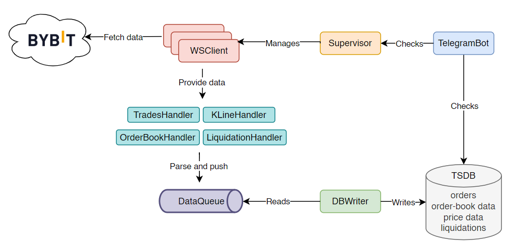

# Architecture

## Diagram

<p align="center">
  
</p>

## How It Works

### Startup & Supervision

At startup, the **Supervisor** reads the list of configured crypto pairs and spawns one **WSClient** task per pair. Each **WSClient** independently opens a WebSocket connection to Bybit and subscribes to all configured data feeds for its symbol. If a **WSClient** exhausts all its internal reconnection attempts and crashes, the Supervisor intercepts the failure, logs it, sends a Telegram alert, and relaunches the task automatically after a short delay — without affecting any other running pair.

### Data Flow

Once connected, each **WSClient** receives a continuous stream of raw JSON messages from Bybit. Every incoming message is routed to the appropriate **Handler** based on its topic — trades, order book, kline, or liquidation. The handler parses the raw payload, maps it to a typed model, and pushes a **QueueItem** (containing the target table name and the model instance) onto the shared **DataQueue**.

The **DBWriter** runs concurrently and continuously reads from the queue. Incoming items are grouped into per-table in-memory buffers. The writer flushes a buffer to **TimescaleDB** either when it reaches a configured size threshold or when a periodic time interval elapses — whichever comes first. In case of a write failure, records are kept in the buffer and retried on the next flush cycle to avoid data loss.

---

## Main Components

1. **DB (TimescaleDB)**

   PostgreSQL database with the TimescaleDB extension. Stores all collected data across 4 hypertables: `orders`, `price_data`, `orderbook_data`, `liquidations`. Runs in its own Docker container.

   ```{admonition} ADR — Why TimescaleDB over PostgreSQL?
   :class: important
   TimescaleDB was chosen for several reasons. First, as a learning opportunity to experiment with a purpose-built time-series database in a real-world scenario. Second, TimescaleDB is specifically optimised for time-series workloads: it automatically partitions data into time-based chunks, making range queries significantly faster and allowing native compression as the dataset grows — both critical for a system that accumulates market data continuously.

   Compared to plain **PostgreSQL**, TimescaleDB provides automatic time partitioning and chunk-level compression out of the box, without requiring manual table partitioning strategies. Since TimescaleDB is built on top of PostgreSQL, future extensions — such as storing user trading strategies or order management data in a separate relational database — remain fully compatible with the existing stack and tooling.
   ```

2. **DB Connection**

   Creates and manages an `asyncpg` connection pool shared across the whole app. Also registers the JSONB codec so order book data serializes automatically.

3. **DB Models**

   Simple dataclasses (`Order`, `PriceData`, `OrderbookData`, `Liquidation`). Pure data containers — no logic, just the shape of a record to properly save it in the DB.

4. **DBWriter**

   Reads `QueueItem`s from the `DataQueue`, groups them into per-table in-memory buffers, and flushes to the DB either when a buffer reaches a size threshold or on a time interval — whichever comes first. On insert failure, records are put back in the buffer to avoid data loss.

   ```{admonition} ADR — Dual flush strategy: time interval + batch size threshold
   :class: important
   The DBWriter flushes data to TimescaleDB under two conditions: either when a configurable time interval elapses, or when the number of buffered records for a given table reaches a configured threshold — whichever happens first. This dual strategy was necessary because the different WebSocket feeds produce data at very different rates and volumes. Trades and order book updates arrive at high frequency, while klines and liquidations are comparatively sparse. Relying solely on a time interval would allow high-frequency buffers to grow excessively large in memory, while relying solely on batch size would cause sparse-feed buffers to never flush in quiet market conditions. The combined approach keeps memory usage bounded while ensuring all data is persisted in a timely manner.
   ```

5. **DataQueue**

   A shared `asyncio.Queue`. The bridge between the fetching side (handlers) and the writing side (DBWriter). Each item carries a target table name and a model instance.

   ```{admonition} ADR — Why a shared queue between handlers and DBWriter?
   :class: important
   The `DataQueue` decouples data production (WebSocket handlers) from data persistence (DBWriter), allowing both sides to operate at their own pace without blocking each other. Handlers can push parsed records into the queue immediately after receiving a message, without waiting for a database write to complete. The DBWriter consumes from the queue independently and handles batching and flushing at its own rhythm. This separation prevents slow or failing DB writes from stalling the WebSocket message loop and causing missed data. Using `asyncio.Queue` specifically ensures the queue operates safely within Python's single-threaded event loop without any locking overhead.
   ```

6. **Specific Handlers**

   `TradesHandler`, `KlineHandler`, `LiquidationHandler`, `OrderbookHandler` — each handles one type of incoming WebSocket message. Parses the raw JSON, builds the appropriate model, and pushes a `QueueItem` onto the `DataQueue`.

   ```{admonition} ADR — Why a separate handler per topic?
   :class: important
   Each data feed received through the WebSocket carries a different JSON structure depending on its topic. Trades, klines, liquidations, and order book updates each require a different parsing strategy and produce a different data model. A single generic handler would not be able to correctly interpret all of them without becoming a complex branching structure that is difficult to maintain and extend. Separating concerns into one handler per topic keeps each class focused, testable, and independently replaceable.

   The `OrderbookHandler` is a notable special case: incoming order book messages are not simply forwarded to the queue as-is. Instead, they are used to maintain a live, in-memory representation of the order book state. This local snapshot is then persisted to the database at a fixed interval (configurable, defaulting to every 60 seconds), rather than on every individual update message — which would produce an impractical volume of writes.
   ```

7. **WSClient**

   Manages one WebSocket connection per crypto pair. Subscribes to all configured topics, sends periodic pings to keep the connection alive, routes incoming messages to the right handler by topic prefix, and reconnects with exponential backoff on failure.

   ```{admonition} ADR — Why automatic reconnection with exponential backoff?
   :class: important
   WebSocket connections to external services can be interrupted for a wide range of reasons: network instability, server-side restarts, timeouts due to inactivity, or temporary Bybit infrastructure issues. Without a reconnection mechanism, a single transient network error would permanently halt data collection for the affected pair until a manual restart.

   The `WSClient` implements exponential backoff reconnection: each consecutive failure doubles the wait time before the next attempt, up to a configured maximum, and up to a maximum number of retries. This approach avoids hammering the exchange server during an outage while still recovering automatically as soon as connectivity is restored. On reconnect, the client re-subscribes to all configured topics and notifies the status tracker and Telegram bot, ensuring full operational recovery without any human intervention.
   ```

8. **Supervisor**

   Manages one `WSClient` task per crypto pair. If a `WSClient` exhausts all its internal retries and crashes, the Supervisor catches it, logs it, sends a Telegram alert, and relaunches it after a delay.

   ```{admonition} ADR — Two-layer resilience strategy
   :class: important
   The system implements a two-layer resilience model. The first layer is internal to each `WSClient`: on any connection error, it attempts to reconnect autonomously using exponential backoff, up to a configurable maximum number of retries. This handles the most common transient failures — brief network interruptions, temporary server unavailability — without escalating.

   The second layer is the `Supervisor`. If a `WSClient` exhausts all its retry attempts and its asyncio task terminates with an unhandled exception, the Supervisor intercepts the failure via a task completion callback. It logs the error, sends a Telegram alert, and schedules a full relaunch of the `WSClient` task after a configurable delay. Each pair is managed independently, so a crash in one does not affect the data collection of any other. This separation of concerns keeps the recovery logic clean and ensures the system can self-heal from failures that go beyond simple reconnection.
   ```

9. **TelegramBot**

   Runs as a parallel asyncio task. Exposes commands for monitoring (`/status`, `/stats`, `/dbsize`) and control (`/forceStop`, `/enableNotifications`, `/disableNotifications`). Shares the DB pool and a `stop_event` with the rest of the app.

   ```{admonition} ADR — Remote monitoring via Telegram bot
   :class: important
   The Telegram bot was introduced as an asyncio task running alongside the data collection pipeline, so it does not block or interfere with the main operations in any way. Command routing, message parsing, and response delivery are fully managed by the `python-telegram-bot` library, keeping the implementation minimal.

   The bot provides a lightweight remote interface to the system: it allows monitoring the health of each WebSocket connection, checking how much data has been collected per symbol, inspecting the database size, and shutting down the application gracefully — all without needing to SSH into the server. This makes day-to-day observation of a 24/7 running service significantly more practical.
   ```

---

## System-Level ADRs

```{admonition} ADR — Single-threaded async event loop vs. threads vs. processes
:class: important
The entire application runs on a single-threaded `asyncio` event loop rather than using multiple threads or multiple processes.

**Threads** would introduce the complexity of shared state synchronisation, locking, and potential race conditions — particularly around the shared queue, the DB connection pool, and the status tracker. In Python, threads are also constrained by the Global Interpreter Lock (GIL), which prevents true parallel CPU execution for pure Python code, making threads mostly useful only for I/O concurrency.

**Multiple processes** (via `multiprocessing`) would bypass the GIL but would require explicit inter-process communication mechanisms (pipes, shared memory, message queues), significantly increasing the architectural complexity for what is fundamentally an I/O-bound workload.

**The async event loop** is the right fit for this application because all operations — WebSocket reads, database writes, Telegram polling — are I/O-bound. `asyncio` handles concurrency by interleaving tasks at every `await` point, without spawning threads or processes. This means no locking, no GIL contention, and no synchronisation overhead. The code remains sequential and readable while achieving full concurrency across all WebSocket connections, the DB writer, and the Telegram bot simultaneously.
```

```{admonition} ADR — Configuration via config.json
:class: important
The application is entirely driven by a `config.json` file that is mounted at runtime and never baked into the Docker image. This covers database connection parameters, Telegram bot credentials, exchange WebSocket URL and subscriptions, and all tunable application settings such as batch sizes, flush intervals, reconnection delays, and ping intervals.

This approach allows switching between environments (e.g. a test Telegram bot and a production one, or a local DB and a remote one) without modifying any code — only the mounted configuration file changes. It also keeps secrets out of the repository and out of the container image, which is the correct practice for containerised deployments. Tuning performance-related parameters such as batch sizes or reconnect delays can be done by simply editing the file and restarting the container, with no rebuild required.
```
