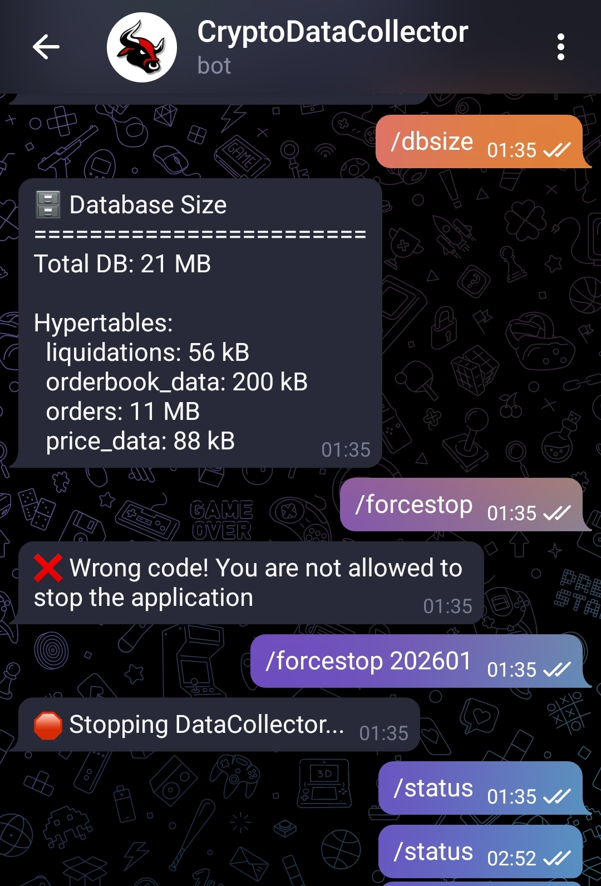
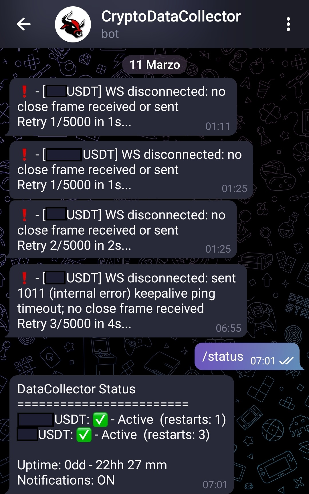
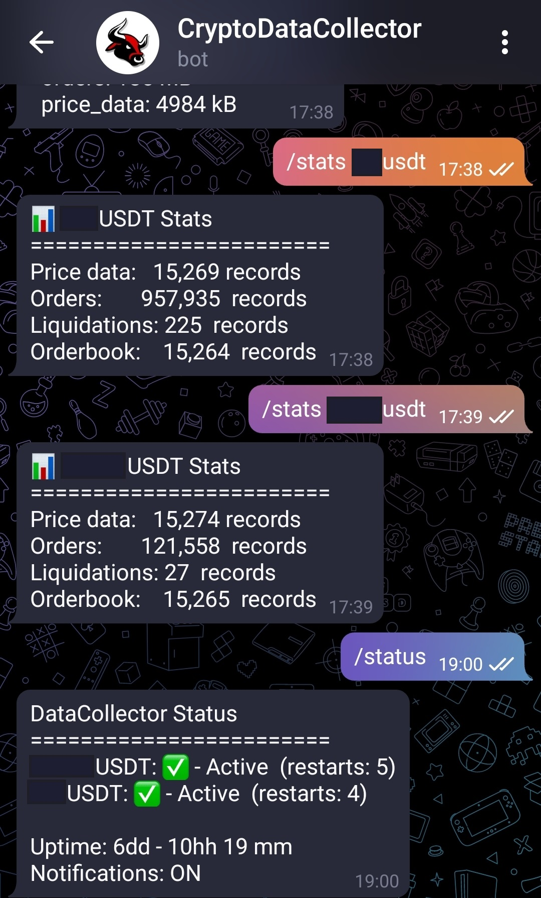
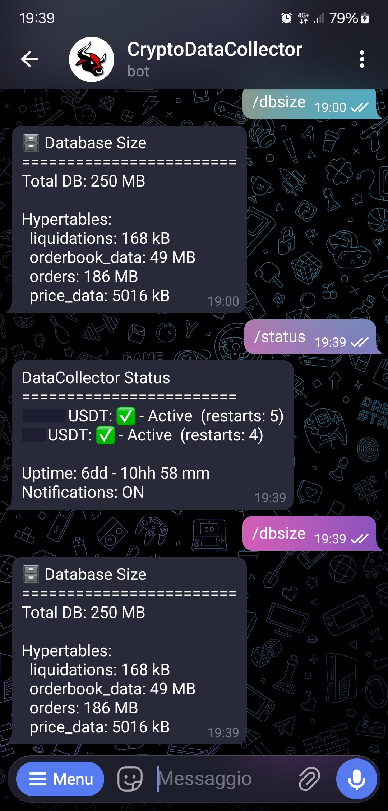

# Demo

## Deployment & Monitoring

DataCollector runs on a **VPS (Virtual Private Server)** — not on a local machine — so it stays active 24/7 without requiring any PC to be left on. The application is packaged as a Docker container and orchestrated alongside the TimescaleDB container via Docker Compose.

Once deployed, the only interface needed to monitor and control the service is **Telegram**. The following commands are available:

| Command | Description |
|---|---|
| `/status` | Shows the connection state, uptime, and restart count for each tracked crypto pair |
| `/stats <SYMBOL>` | Returns the total number of records collected per table for a given symbol (e.g. `/stats BTCUSDT`) |
| `/dbsize` | Shows the total database size and the size of each individual hypertable |
| `/enableNotifications` | Turns on automatic alerts for disconnections or errors |
| `/disableNotifications` | Silences automatic alerts |
| `/forceStop <code>` | Remotely shuts down the service using a time-based PIN |

The screenshots below show these commands in action — checking the health of active connections, monitoring how the database is growing over time, and performing a controlled remote shutdown when needed.

---

## Screenshots

---

### Monitoring DB Size & Emergency Stop

  
  

    The <code>/dbsize</code> command gives an instant overview of how much storage the database is consuming — both in total and broken down per hypertable.
    If something looks off — such as an unexpected spike in data volume or approaching the VM's memory limits — the service can be immediately halted remotely via <code>/forceStop</code>,
    which requires entering a time-based PIN to confirm the operation and prevent accidental shutdowns.
  

---

### Automatic Reconnection While Sleeping

  
  

    During the night, several WebSocket connections dropped — the exchange stopped responding to keepalive pings and no reply messages were received.
    The built-in exponential backoff mechanism detected the failures, waited progressively longer between each retry, and successfully re-established all connections
    without any human intervention. By morning, every pair was online and collecting data as expected.
  

---

### Checking Collection Status Per Pair

  
  

    The <code>/stats</code> command provides a per-symbol breakdown of how many records have been collected across all four tables:
    price data, order-book snapshots, orders, and liquidations.
    The <code>/status</code> command complements this by showing the live connection state for each monitored crypto pair,
    including uptime and how many times each connection has been restarted since the service launched.
  

---

### Data Ready for Analysis

  
  

    After running continuously for the desired period, enough data was accumulated to begin pattern detection and strategy development.
    At the time of this snapshot, the database had grown to <strong>250 MB</strong> — tick-level market data across all monitored pairs,
    fully owned, self-hosted, and available for any downstream analysis without limitations or recurring costs.
  

